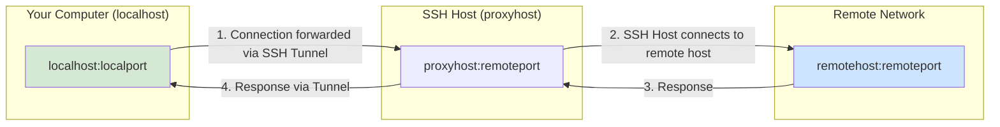
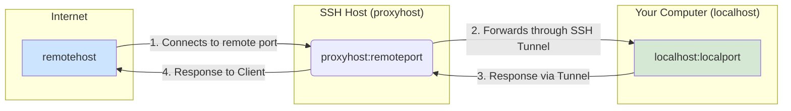
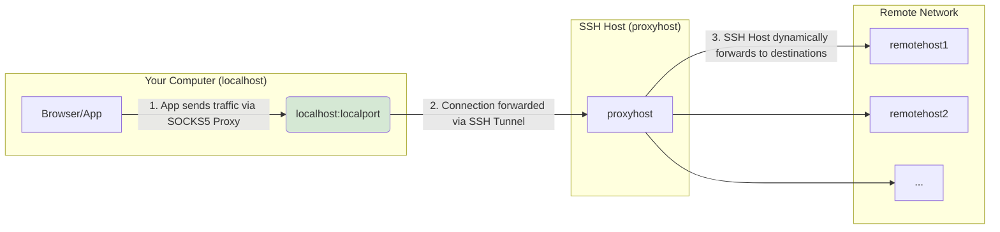

# ssh-tunnel-agent

> Maintains multiple SSH tunnels in a persistent tmux session

A lightweight bash tool that manages SSH tunnels through tmux, with automatic reconnection and optional launchd integration for macOS.

## Features

- **Multiple Tunnel Types** - Local forwards, dynamic SOCKS proxies, and remote forwards
- **Configuration-based** - Define all tunnels in a single config file
- **Automatic Recovery** - Reconnects on failure with configurable keep-alive
- **tmux Integration** - Organized view of all tunnel connections
- **macOS LaunchAgent** - Optional automatic startup and config file watching
- **Simple Setup** - File-based configuration, easy install/uninstall via [`Makefile`](Makefile)

## Quickstart

```bash
git clone https://github.com/ardnew/ssh-tunnel-agent.git
cd ssh-tunnel-agent
make help
```

## Installation

```bash
make install
make enable    # macOS only (launchd integration)
```

## Configuration

Edit the config file at `~/.config/ssh-tunnel-agent/config`:

```bash
# SSH Connection Settings
ssh_config[host]="proxyhost"
ssh_config[port]="22"
ssh_config[user]="${USER}"
ssh_config[term]="xterm-256color"

# Tunnel Definitions
tunnel_spec=(
  [web]="L:8080:webserver:80"
  [socks]="D:1080"
  [database]="L:5432:dbserver:5432"
)
```

### Tunnel Types

| Type | Format | Example | Description |
|------|--------|---------|-------------|
| [**`L`**](#local-port-forward-l) | `L:localport:remotehost:remoteport` | `L:8080:web.private:80` | [Local port forward](#local-port-forward-l) |
| [**`R`**](#remote-port-forward-r) | `R:remoteport:localhost:localport` | `R:9000:localhost:9000` | [Remote port forward](#remote-port-forward-r) |
| [**`D`**](#dynamic-socks-proxy-d) | `D:localport` | `D:1080` | [Dynamic SOCKS proxy](#dynamic-socks-proxy-d) |

Multiple tunnels can be combined for a single connection.

#### Local Port Forward (L)

This diagram shows how a local port on your machine is forwarded through an SSH host to a destination server.

This is useful for accessing services on a remote network as if they were running locally.



#### Remote Port Forward (R)

This diagram illustrates how a port on the remote SSH host is forwarded back to a service running on your local machine. This is often used to expose a local development server to the internet through a public-facing SSH host.



#### Dynamic SOCKS Proxy (D)

This diagram shows how a dynamic SOCKS proxy works. Your applications are configured to send traffic to a local port, and the SSH client dynamically forwards this traffic through the SSH host to any destination. This effectively makes all your proxied traffic appear to originate from the SSH host.



## Usage

### Manual Control

```bash
ssh-tunnel-agent.tmux start           # Start tunnels in background
ssh-tunnel-agent.tmux start -a        # Start and attach to tmux session
ssh-tunnel-agent.tmux status          # Show active tunnels
ssh-tunnel-agent.tmux attach          # Attach to running session
ssh-tunnel-agent.tmux stop            # Stop all tunnels
ssh-tunnel-agent.tmux restart         # Restart tunnel session
ssh-tunnel-agent.tmux list            # List configured tunnels
```

### macOS LaunchAgent

```bash
launchctl list | grep ssh-tunnel-agent           # Check if running
launchctl unload -w ~/Library/LaunchAgents/ssh-tunnel-agent.plist   # Stop agent
launchctl load -w ~/Library/LaunchAgents/ssh-tunnel-agent.plist     # Start agent
```

View logs:
```bash
tail -f /tmp/ssh-tunnel-agent/launchd-*.log
```

## Examples

**Web development tunnelled through SSH host:**
```bash
tunnel_spec=(
  [dev]="L:3000:web.internal:3000 L:3001:ssl.internal:3001"
  [api]="L:8080:api.internal:8080"
)
```

**Database access:**
```bash
tunnel_spec=(
  [postgres]="L:5432:db.internal:5432"
  [redis]="L:6379:cache.internal:6379"
)
```

**General SOCKS proxy for all traffic:**
```bash
tunnel_spec=(
  [proxy]="D:1080"
)
```

Then configure your browser or system to use `localhost:1080` as a SOCKS proxy.

## Uninstall

```bash
make uninstall
```

This removes all installed files and optionally prompts to remove your config file.
